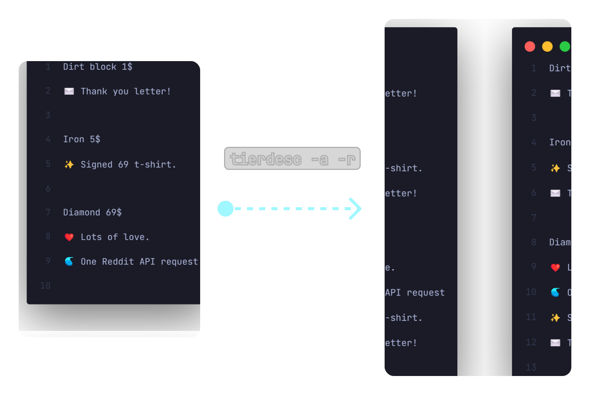

<p align="center">
    
</p>

<h1 align="center">
    tierdesc
</h1>

tierdesc is a simple CLI tool made to list tier benefits in the description in platforms like Patreon.

Manually listing previous benefits in each new tier is time-consuming, and while built-in tier listing features help, they still require manual updates if anything changes (so it's **slower in the long run**, this might get changed in the future). A better solution? Use a tool like tierdesc to streamline this — or simply skip listing previous benefits in each tier.

tierdesc can list the previous benefits in the other tiers for you to copy and paste. You can also generate a file with all benefits listed properly. tierdesc has other helpful features too like **exporting in different formats, reversing** and more!

<p align="center">
    
</p>

## ✨ Usage

```sh
Usage: python main.py <tier_name> [options]

Options:
  -h, --help           Show this help message and exit
  -i, --input <file>   Specify the input file (default: tiers.txt)
  -t, --tiers          List available tiers and prices
  -b, --benefits       List all unique benefits across tiers
  -a, --all            Output all tiers with benefits
  -r, --reverse        List benefits in reverse order (higher tier benefits appear first)
  -c, --copy           Copy output to clipboard
  -o, --output <file>  Specify a file to write output (default: output.txt)
  -e, --export <fmt>   Export all tiers to different format (json, csv, markdown, html, xml, yaml, toml, turtle, latex, rss, asciidoc, odt)
```

Download the executable or clone the repository and use Python. Usage depends on whether you use the executable or the Python version.

For the executable, run `tierdesc --help` if you added it to the environment variables otherwise you have to do something like `tierdesc.exe --help` while being in the same directory where the file is located.

You can download the `tiers.txt` file to get an idea of how the tiers with benefits need to be listed for it to work. You can also mess around with this file to learn about the tool.

---

<p align="center"><a href="https://www.patreon.com/axorax">Support me on Patreon</a> — <a href="https://github.com/axorax/socials">Check out my socials</a></p>